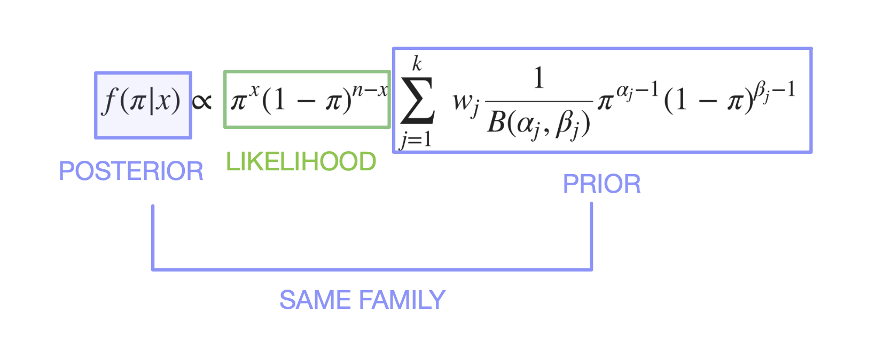

```{r}
#| echo: FALSE
#| include: FALSE
# Load relevant packages
library(tidyverse)
library(flextable)
library(ggplot2)
library(kableExtra)
library(formattable)
library(devtools)
devtools::install_github("https://github.com/Genentech/phase1b", force = TRUE)
library(phase1b)
library(checkmate)
library(cowplot)
```

```{r global_options}
#| echo: FALSE
#| include: FALSE
knitr::opts_chunk$set(fig.pos = "H")
```

```{r}
# source R scripts

# Pfizer/BionTech study
calc_ve <- function(theta) { #  theta = case rate ratio
  assert_number(theta, lower = 0, upper = 1)
  (1 - 2 * theta) / (1 - theta)
}
calc_theta <- function(ve) {
  assert_number(ve, lower = 0, upper = 1)
  (1 - ve) / (2 - ve)
}

# Posterior Probability data for plots
alpha <- 0.6
beta <- 0.4
interim_x <- 16
interim_n <- 23
alpha_updated <- alpha + interim_x
beta_updated <- beta + interim_n - interim_x
new_mean <- alpha_updated / (alpha_updated + beta_updated)
new_mode <- (alpha_updated - 1) / (alpha_updated + beta_updated - 2)

xx <- seq(0, 1, .001)
Mix2 <- paste("Prior of a =", alpha, ", b =", beta)
Mix3 <- paste("Updates Posterior with a =", alpha + interim_x, ", b =", beta + interim_n - interim_x)


postprob_data <- data.frame(
  rate = rep(xx, 3),
  Density = c(
    dbeta(xx, 1, 1),
    dbeta(xx, alpha, beta),
    dbeta(xx, alpha_updated, beta_updated)
  ),
  Category = c(
    rep(
      "Uniform Prior a = b = 1",
      length(xx)
    ),
    rep(
      Mix2,
      length(xx)
    ),
    rep(Mix3, length(xx))
  )
)

# Effect of weights (and beta Mixtures)
alpha <- 0.6
beta <- 0.4
alpha0 <- 6
beta0 <- 4
alpha1 <- 12
beta1 <- 8

xx <- seq(0, 1, .001)
Mix <- paste0("Prior B(", alpha, ",", beta, ") with 100% weights")
Mix1 <- paste0("Prior B(", alpha0, ",", beta0, ") with 60%:40% weighting with Uniform Prior")
Mix2 <- paste0("Prior B(", alpha1, ",", beta1, ") with 40%:60% weighting with Uniform Prior")
Mix3 <- paste0("Prior B(", alpha0, ",", beta0, ") with 90%:10% weighting with Uniform Prior")
Mix4 <- paste0("Prior B(", alpha1, ",", beta1, ") with 10%:90% weighting with Uniform Prior")

Mix_values <- phase1b::dbetaMix(x = xx, par = rbind(c(alpha, beta)), weights = c(1), log = FALSE)
Mix1_values <- phase1b::dbetaMix(x = xx, par = rbind(c(alpha0, beta0), c(1, 1)), weights = c(0.6, 0.4), log = FALSE)
Mix2_values <- phase1b::dbetaMix(x = xx, par = rbind(c(alpha1, beta1), c(1, 1)), weights = c(0.4, 0.6), log = FALSE)
Mix3_values <- phase1b::dbetaMix(x = xx, par = rbind(c(alpha0, beta0), c(1, 1)), weights = c(0.9, 0.1), log = FALSE)
Mix4_values <- phase1b::dbetaMix(x = xx, par = rbind(c(alpha1, beta1), c(1, 1)), weights = c(0.1, 0.9), log = FALSE)
# even if you had a high weighting on a weak prior, the resulting beta mixture will favour the shape of that preferred prior
data_prior <- data.frame(
  rate = rep(xx, 5),
  Density = c(
    Mix_values,
    Mix1_values,
    Mix2_values,
    Mix3_values,
    Mix4_values
  ),
  Category = c(
    rep(
      Mix,
      length(xx)
    ),
    rep(
      Mix1,
      length(xx)
    ),
    rep(
      Mix2,
      length(xx)
    ),
    rep(
      Mix3,
      length(xx)
    ),
    rep(
      Mix4,
      length(xx)
    )
  )
)

data_prior$Category <- factor(data_prior$Category,
  levels = c(Mix, Mix1, Mix2, Mix3, Mix4),
  ordered = TRUE
)
# Predictive Posterior data for plots
control <- 0.6
thetaT_low <- 0.6
result <- predprob(
  x = 16, n = 23, Nmax = 40, p = control, thetaT = thetaT_low,
  parE = c(0.6, 0.4)
)

thetaT_high <- 0.9
result_high_thetaT <- predprob(
  x = 16, n = 23, Nmax = 40, p = control, thetaT = thetaT_high,
  parE = c(0.6, 0.4)
)
data <- rbind(result$table, result_high_thetaT$table)

data$thetaT <- c(rep("60%", 18), rep("90%", 18))
df_thetaTlow <- data %>% dplyr::filter(thetaT == "60%")
df_thetaTlow$cumul_x <- df_thetaTlow$counts + 16

df_thetaThigh <- data %>% dplyr::filter(thetaT == "90%")
df_thetaThigh$cumul_x <- df_thetaThigh$counts + 16
```

# A Bayesian approach to decision making in early development Oncology clinical trials{background-gradient="linear-gradient(to top, #F8FAB4, #A7AAE1)"}

Audrey Yeo, Basel - CH


## Introduction

\
\

::: center
{width="34%"} {width="30%"}
{width="30%"}
:::

## Introduction

\
\

:::::: columns
::: {.column width="10%"}
:::

::: {.column width="40%"}
{width="70%"}
:::

::: {.column width="40%"}
{width="80%"}
:::
::::::

# Early oncology trials and why `phase1b`?

## Objectives

:::::: columns
::: {.column width="40%"}
-   Introduce Beta Binomial model
-   Explore `postprob` and `predprob`
-   Explore simulation studies using `ocPostprob`
-   Operating characteristics
-   Question and answer
:::

```{r}
# | fig-alt : "This hexagon is the R sticker for phase1b R package. It has a bright purple background, light orange border and the title is in fuschia. The graph in the middle is a CDF distribution in dots that changes from red dots to green dots to indicate a stop to go decision"
```

::: {.column width="10%"}
:::

::: {.column width="\"40%"}
\
{width="50%"}
:::
::::::

## The Posterior Construction

Beta Prior is a conjugate to the Posterior. *Merriam-Webster Dictionary*
on "conjugate" : `coupled, connected, or related.`

$$ {P( B | A)} =  { {P(A|B)P(B)} \over {P(A) } } $$

```{r}
#| fig-align: center

```

## Prior and Posterior of Beta Distribution for response rate {.smaller}

-   Conjugate Prior \pi is $f(\pi)$, where
    $\pi \sim {Beta(\alpha, \beta)}$, same family of distribution of
    Posterior (see below)

-   We know the mean response rate (RR) is :
    $$\pi = \ \frac {\alpha}{\alpha + \beta}$$

-   Likelihood is $f(x|\pi)$, where $x \sim {Binomial(x, n)}$

-   The updated Posterior $f( \pi | x )$ is again a $Beta$ distribution
    (same family as prior) :
    $$ \pi| \ x \sim Beta(\alpha + x, \ \beta + n - x)$$ where $x$ is
    the number of responders of current trials


## History and how to install : {.smaller}

-   2015 : Started as a need in Roche's early development group, package
    development led by Daniel Sabanés Bové in 2015.
    [`r fontawesome::fa("linkedin")`](https://www.linkedin.com/in/danielsabanesbove/)
    [`r fontawesome::fa("github")`](https://github.com/danielinteractive)
    [`r fontawesome::fa("globe")`](https://rconis.com)

-   2023 : Refactoring, Renaming, adding Unit and Integration tests as
    current State-of-Art Software Engineering practice.

-   2026 : CRAN submission is anticipated

-   100% written in R and Open Source.

-   website :
    [genentech.github.io/phase1b/](genentech.github.io/phase1b/)

```{r, eval = FALSE, echo = TRUE, warning = FALSE}
library(devtools)
devtools::install_github("https://github.com/Genentech/phase1b")
library(phase1b)
```

## Use case: {.smaller}

```{r, warning = FALSE}
# | fig-alt: This table sets the scene of a problem a study statistician could have. At interim, there are 16/23 responders and they ask, what is the Posterior Probability, what is the Predictive Posterior Probability, is the decision to Go (continue drug development), Stop (terminate drug development) or in between called the "Grey Zone" where team may need additional supporting evidence to make a decision.
r_interim <- 16
n_interim <- 23
r_final <- 23
n_final <- 40
use_case <- data.frame(
  Example = c(
    "Responders",
    "n",
    "Response rate",
    "Posterior probability*",
    "Predictive posterior probability*",
    "Decision to develop molecule further :\n Go/Stop/Grey Zone"
  ),
  Interim = c(
    r_interim,
    n_interim,
    paste(
      round(
        (r_interim / n_interim) * 100,
        digits = 1
      ),
      "%"
    ),
    "ask phase1b",
    "ask phase1b",
    "ask phase1b"
  ),
  Final = c(
    r_final,
    n_final,
    paste(
      round(
        (r_final / n_final) * 100,
        digits = 1
      ),
      "%"
    ),
    "ask phase1b",
    "-",
    "ask phase1b"
  )
)

use_case %>%
  kbl(align = "c", caption = "A single arm novel therapeutic with an assumed control response rate is at most 60%") %>%
  kable_styling()
```

\
\
\* Posterior Probability :
$P (\pi > 60 \% | \alpha + x, \beta + n - x )$\
\* Predictive Posterior Probability :
$P (success \ or \  failure \ at \ final)$

## Updating the Posterior{.smaller}

\
\

::: {.center}
-   Using the formula for the mean, where 
$$\alpha = 0.6, \beta = 0.4$$
    and at interim x = 16, n = 23 :
    $$ \pi = \ \frac {\alpha}{\alpha + \beta} = \ \frac {\alpha_{updated} }{\alpha_{updated} + \beta_{updated}} = \ \frac {16.6 }{16.6 + 7.4} ≈ 69.17 \% $$

    $$ mode (\pi) = \ \frac {\alpha_{updated} -1 }{\alpha_{updated} + \beta_{updated} - 2} = \ \frac {16.6 -1  }{16.6 + 7.4 - 2} ≈ 70.90 \% $$
:::

## 

```{r , fig.align='center'}
#| fig-alt: This plot shows how the prior can be updated from data and compares with the uniform beta prior.
#|
p <- ggplot(postprob_data) +
  geom_line(
    aes(
      x = rate,
      y = Density,
      colour = Category
    ),
    size = 1.0
  ) +
  ggtitle("Historical prior and Updated posterior distribution from 16 responders\n of 23 at interim analysis for a single arm oncology trial") +
  scale_x_continuous(n.breaks = 10, labels = scales::percent_format()) +
  ylab("Density") +
  xlab("Response Rate") +
  theme(plot.title = element_text(
    size = 15,
    family = "Helvetica"
  )) +
  scale_color_manual(
    values =
      c("#FE7743", "#8C00FF", "#096B68", "black")
  ) +
  scale_y_continuous(limits = c(0, 7)) +
  geom_vline(
    aes(xintercept = new_mode),
    linetype = "dashed",
    size = 0.5,
    colour = "#096B68"
  ) +
  geom_vline(
    xintercept = new_mean,
    linetype = "dashed",
    size = 0.5,
    colour = "#009"
  ) +
  theme_minimal()

p + theme(
  legend.position = c(0.4, 0.8),
  legend.background = element_rect("transparent"),
  legend.text = element_text(size = 8, family = "Galvji"),
  legend.title = element_text(size = 10, family = "Galvji"),
  axis.text = element_text(size = 12, family = "Galvji"),
  axis.title.x = element_text(margin = margin(t = 15)),
  axis.title.y = element_text(margin = margin(r = 15)),
  axis.title = element_text(size = 15, family = "Galvji")
)
```

## A variety of Priors {.smaller}

-   To illustrate how density of Prior changes with increased sample
    size even though mean is the same

```{r, fig.align="center"}
#| out-width: "70%"
#| fig-alt: This plot shows how the priors of mean 50% can have improving precision with increased sample size.
xx <- seq(0, 1, .001)

data <- data.frame(
  rate = rep(xx, 4),
  Density = c(dbeta(xx, 10, 10), dbeta(xx, 20, 20), dbeta(xx, 30, 30), dbeta(xx, 40, 40)),
  Category = c(
    rep("alpha = beta = 10", length(xx)),
    rep("alpha = beta = 20", length(xx)),
    rep("alpha = beta = 30", length(xx)),
    rep("alpha = beta = 40", length(xx))
  )
)

p <- ggplot(data) +
  geom_line(aes(x = rate, y = Density, colour = Category), size = 1.0) +
  ggtitle("Priors of mean 50% can have improving precision with increased sample size") +
  scale_x_continuous(n.breaks = 10, labels = scales::percent_format()) +
  ylab("Density") +
  xlab("Response Rate") +
  geom_vline(xintercept = 0.5, linetype = "dotted", colour = "#FF0060") +
  theme(plot.title = element_text(size = 15, family = "Helvetica")) +
  scale_color_manual(values = c("#FF9D23", "#C5172E", "#16C47F", "#344CB7")) +
  scale_y_continuous(limits = c(0, 8)) +
  theme_minimal()
p + theme(
  legend.position = c(0.8, 0.6),
  legend.background = element_rect("transparent"),
  legend.text = element_text(size = 8, family = "Galvji"),
  legend.title = element_text(size = 10, family = "Galvji"),
  axis.text = element_text(size = 12, family = "Galvji"),
  axis.title.x = element_text(margin = margin(t = 15)),
  axis.title.y = element_text(margin = margin(r = 15)),
  axis.title = element_text(size = 15, family = "Galvji")
)
```

## A variety of Posteriors with varying priors {.smaller}

-   Data showed 16 of 23 responders (\~69% response rate)

```{r, fig.align="center"}
#| out-width: "70%"
#| fig-alt: This plot shows how the priors of mean 50% can have improving precision with increased sample size.
x <- 16
n <- 23
xx <- seq(0, 1, .001)

data <- data.frame(
  rate = rep(xx, 4),
  Density = c(dbeta(xx, 10 + x, 10 + n - x), dbeta(xx, 20 + x, 20 + n - x), dbeta(xx, 30 + x, 30 + n - x), dbeta(xx, 40 + x, 40 + n - x)),
  Category = c(
    rep("alpha = beta = 10", length(xx)),
    rep("alpha = beta = 20", length(xx)),
    rep("alpha = beta = 30", length(xx)),
    rep("alpha = beta = 40", length(xx))
  )
)

p <- ggplot(data) +
  geom_line(aes(x = rate, y = Density, colour = Category), size = 1.0) +
  ggtitle("Posteriors of Priors with mean 50% with increasing sample size") +
  scale_x_continuous(n.breaks = 10, labels = scales::percent_format()) +
  ylab("Density") +
  xlab("Response Rate") +
  geom_vline(xintercept = 0.5, linetype = "dotted", colour = "#FF0060") +
  theme(plot.title = element_text(size = 15, family = "Helvetica")) +
  scale_color_manual(values = c("#FF9D23", "#C5172E", "#16C47F", "#344CB7")) +
  scale_y_continuous(limits = c(0, 9.0)) +
  theme_minimal()

p + theme(
  plot.title = element_text(famile = "Galvji"),
  legend.position = c(0.85, 0.6),
  legend.background = element_rect("transparent"),
  legend.text = element_text(size = 12, family = "Galvji"),
  legend.title = element_text(size = 15, family = "Galvji"),
  axis.text = element_text(size = 12, family = "Galvji"),
  axis.title.x = element_text(margin = margin(t = 15)),
  axis.title.y = element_text(margin = margin(r = 15)),
  axis.title = element_text(size = 15, family = "Galvji")
)
```

## Effect of weights (and beta Mixtures)

```{r}
plot_prior1 <- ggplot(data_prior[data_prior$Category %in% c(Mix3, Mix4), ]) +
  theme_classic() +
  geom_line(aes(x = rate, y = Density, colour = Category), size = 1.0) +
  scale_x_continuous(n.breaks = 10, labels = scales::percent_format()) +
  ylab("Density") +
  xlab("Response Rate") +
  scale_y_continuous(limits = c(0, 3)) +
  theme(plot.title = element_text(size = 15, family = "Helvetica")) +
  geom_segment(
    aes(
      x = 0.6,
      xend = 0.6,
      y = 0,
      yend = 2.5
    ),
    colour = "#F19ED2",
    linetype = "dashed",
    alpha = 0.4
  ) +
  scale_color_manual(values = c("#91DDCF", "#82A0D8", "#6A9C89", "#FFA725", "#F19ED2")) # alt c("#91DDCF", "#82A0D8")

plot_prior1 <- plot_prior1 + theme(
  legend.position = c(0.5, 0.9),
  legend.background = element_rect("transparent"),
  legend.text = element_text(size = 10, family = "Galvji"),
  legend.title = element_text(size = 11, family = "Galvji"),
  axis.text = element_text(size = 9, family = "Galvji"),
  axis.title.x = element_text(margin = margin(t = 15)),
  axis.title.y = element_text(margin = margin(r = 15)),
  axis.title = element_text(size = 15, family = "Galvji")
)
plot_prior2 <- ggplot(data_prior[data_prior$Category %in% c(Mix1, Mix2), ]) +
  theme_classic() +
  geom_line(aes(x = rate, y = Density, colour = Category), size = 1.0) +
  scale_x_continuous(n.breaks = 10, labels = scales::percent_format()) +
  ylab("Density") +
  xlab("Response Rate") +
  scale_y_continuous(limits = c(0, 3)) +
  geom_segment(
    aes(
      x = 0.6,
      xend = 0.6,
      y = 0,
      yend = 2.5
    ),
    colour = "#F19ED2",
    linetype = "dashed",
    alpha = 0.4
  ) +
  scale_color_manual(values = c("#91DDCF", "#82A0D8", "#FDAB9E", "#F19ED2"))
plot_prior2 <- plot_prior2 + theme(
  legend.position = c(0.5, 0.9),
  legend.background = element_rect("transparent"),
  legend.text = element_text(size = 10, family = "Galvji"),
  legend.title = element_text(size = 11, family = "Galvji"),
  axis.text = element_text(size = 9, family = "Galvji"),
  axis.title.x = element_text(margin = margin(t = 15)),
  axis.title.y = element_text(margin = margin(r = 15)),
  axis.title = element_text(size = 15, family = "Galvji")
)

q <- plot_grid(plot_prior1, plot_prior2)
q
```

## Terminology {.smaller}

-   A look = stop is when a rule is applied
-   The rule = criteria is specified for Go, Stop or Evaluate (Grey
    zone)
-   If the rule is met, the result is Go, Stop or Evaluate (Grey zone)
-   Go = Success = Efficacious
-   Stop = Failure = Futile

## `postprob()` example (Lee & Liu, 2008) {.smaller}

```{r}
r_interim <- 16
n_interim <- 23
r_final <- 23
n_final <- 40
soc_rr <- 0.60
soc_rr_percent <- paste(soc_rr * 100, "%")
data.frame(
  Example = c(
    "Responders",
    "n",
    "Response rate",
    "Standard of Care Response rate",
    "Posterior probability"
  ),
  Interim = c(
    r_interim,
    n_interim,
    paste(
      round(
        (r_interim / n_interim) * 100,
        digits = 2
      ),
      "%"
    ),
    soc_rr_percent,
    "postprob( ) call from phase1b"
  )
) -> use_case

use_case %>%
  kbl(align = "c") %>%
  kable_styling(font_size = 25)
```

```{r, echo = TRUE, warning = FALSE}
phase1b::postprob(x = 16, n = 23, p = 0.60, par = c(0.6, 0.4))
```

## Choice of Weak Priors {.smaller}

\

\

::::: columns
::: {.column width="20"}
-   $\alpha$ = 0.6 = number of responses
-   $\beta$ = 0.4 = number of non-responses
-   $\alpha + \beta$ = 1 = sample size
-   $\mu = 60 \%$
-   $CI = ( 0.66 \%, 99.98 \% )$
:::

::: {.column width="50%"}
```{r}
#| fig-height: 6
lower <- qbeta(
  p = (1 - 0.95) / 2,
  shape1 = alpha,
  shape2 = beta
)

upper <- qbeta(
  p = (1 + 0.95) / 2,
  shape1 = alpha,
  shape2 = beta
)

shade <- data_prior[data_prior$Category == Mix, ] %>% filter(rate < upper & rate > lower)

title_prior <- paste0("Historical prior of alpha = ", alpha, " and beta = ", beta)

ggplot(data_prior[data_prior$Category == Mix, ]) +
  geom_area(
    data = shade, mapping = aes(x = rate, y = Density),
    alpha = 0.5, fill = "#F7CAC9"
  ) +
  geom_line(aes(x = rate, y = Density, colour = Category), size = 2.0) +
  scale_x_continuous(n.breaks = 10, labels = scales::percent_format()) +
  ylab("Density") +
  xlab("Response Rate") +
  scale_y_continuous(limits = c(0, 4)) +
  geom_vline(xintercept = 0.6, linetype = "dashed", linewidth = 0.35, alpha = 0.5) +
  scale_color_manual(values = c("#DC143C")) +
  theme_minimal() +
  theme(
    legend.position = c(0.5, 0.9),
    legend.background = element_rect("transparent"),
    legend.text = element_text(size = 20, family = "Galvji"),
    legend.title = element_text(size = 20, family = "Galvji"),
    axis.text = element_text(size = 12, family = "Galvji"),
    axis.title.x = element_text(margin = margin(t = 25)),
    axis.title.y = element_text(margin = margin(r = 25)),
    axis.title = element_text(size = 20, family = "Galvji")
  ) +
  annotate("text",
    x = 0.45,
    y = 0.30,
    label =
      "CI : (0.0066, 0.999)",
    colour = "#000000",
    family = "Galvji",
    size = 8
  )
```
:::
:::::

## Choice of Stronger Priors {.smaller}

\

\

::::: columns
::: {.column width="40"}
-   $\alpha$ = 6 = number of responses
-   $\beta$ = 4 = number of non-responses
-   $\alpha + \beta$ = 10 = sample size
-   $\mu = 60 \%$
-   $CI = ( 29.93 \% , 86.30 \% )$
:::

::: {.column width="50%"}
```{r}
#| fig-height: 6
lower <- qbeta(
  p = (1 - 0.95) / 2,
  shape1 = alpha0,
  shape2 = beta0
)

upper <- qbeta(
  p = (1 + 0.95) / 2,
  shape1 = alpha0,
  shape2 = beta0
)

title_prior <- paste0("Historical prior of alpha = ", alpha0, " and beta = ", beta0)

shade <- data_prior[data_prior$Category == Mix1, ] %>% filter(rate < upper & rate > lower)

ggplot(data_prior[data_prior$Category == Mix1, ]) +
  geom_area(data = shade, mapping = aes(x = rate, y = Density), fill = "#F7CAC9") +
  geom_line(aes(x = rate, y = Density, colour = Category), size = 2.0) +
  scale_x_continuous(n.breaks = 10, labels = scales::percent_format()) +
  ylab("Density") +
  xlab("Response Rate") +
  scale_y_continuous(limits = c(0, 4)) +
  geom_vline(xintercept = 0.6, linetype = "dashed", linewidth = 0.35, alpha = 0.5) +
  scale_color_manual(values = c("#DC143C")) +
  theme_minimal() +
  theme(
    legend.position = c(0.5, 0.9),
    legend.background = element_rect("transparent"),
    legend.text = element_text(size = 20, family = "Galvji"),
    legend.title = element_text(size = 20, family = "Galvji"),
    axis.text = element_text(size = 12, family = "Galvji"),
    axis.title.x = element_text(margin = margin(t = 25)),
    axis.title.y = element_text(margin = margin(r = 25)),
    axis.title = element_text(size = 20, family = "Galvji")
  ) +
  annotate("text",
    x = 0.6, y = 0.5, label =
      "CI : (0.299 , 0.863)",
    colour = "#000000",
    family = "Galvji",
    size = 8
  )
```
:::
:::::

## Posterior results with varying Priors {.smaller}

```{r}
r_interim <- 16
n_interim <- 23
r_final <- 23
n_final <- 40
soc_rr <- 0.60
soc_rr_percent <- paste(soc_rr * 100, "%")
data.frame(
  Example = c(
    "Responders",
    "n",
    "Response rate",
    "Standard of Care Response rate",
    "Posterior probability"
  ),
  Interim = c(
    r_interim,
    n_interim,
    paste(
      round(
        (r_interim / n_interim) * 100,
        digits = 2
      ),
      "%"
    ),
    soc_rr_percent,
    "postprob( ) call from phase1b"
  )
) -> use_case

use_case %>%
  kbl(align = "c") %>%
  kable_styling(font_size = 25)
```

```{r, echo = TRUE, warning = FALSE}
weaker_prior <- phase1b::postprob(x = 16, n = 23, p = 0.60, par = c(0.6, 0.4))

stronger_prior <- phase1b::postprob(x = 16, n = 23, p = 0.60, par = c(6, 4))
```
<!-- print(paste0("postprob of Weaker prior = ", round(weaker_prior, digits = 3), " and postprob of Stronger prior = ", round(stronger_prior, digits = 3))) -->

Posterior probability of Weaker prior is `r 100*round(weaker_prior, digits = 4)`% and of Stronger prior is `r 100*round(stronger_prior, digits = 4)`%.

## Posterior Probability {.smaller}

-   Interim trial is efficacious if posterior probability exceeds 70% or
    P( RR ≥ 60 % \| data ) \> 70%

```{r, fig.align='center'}
#| label: fig-post
#| layout-ncol: 1 # make graph bigger
#| column: page-right
#| fig-alt : "This graphs side by side show that by increasing number of responders out of 23 reaches our TPP threshold"
threshold <- 0.7
TPP <- 0.6
n <- 23
post_weak <- data.frame(
  x = c(0:n),
  posterior = c(postprob(
    x = 0:n, # P(RR ≥ TPP | x, a, b)
    n = n,
    p = TPP,
    par =
      c(0.6, 0.4)
  ))
)

post_weak$success <- ifelse(post_weak$posterior > threshold, "TRUE", "FALSE")

post_strong <- data.frame(
  x = c(0:n),
  posterior = c(postprob(
    x = 0:n, # P(RR ≥ TPP | x, a, b)
    n = n,
    p = TPP,
    par =
      c(6, 4)
  ))
)
post_strong$success <- ifelse(post_strong$posterior >= threshold, "TRUE", "FALSE")

plot_post_strong0 <- ggplot() +
  geom_point(data = post_strong, aes(
    x = x,
    y = posterior,
    col = success
  ), size = 3) +
  ggtitle(paste("Influence of B(6, 4)")) +
  ylab("Posterior Probability") +
  xlab("Number of responders") +
  scale_x_continuous(breaks = seq(0, n, by = 2)) +
  scale_y_continuous(breaks = seq(0, 1, by = 0.1)) +
  theme(text = element_text(size = 20)) +
  scale_color_manual(values = c("#F93827", "#059212")) +
  theme_gray(base_size = 13) +
  geom_hline(yintercept = 0.7, linetype = "dashed", alpha = 0.5, colour = "#059212", linewidth = 1) +
  theme_minimal() +
  # theme(
  #   legend.position = c(0.8, 0.3),
  #   legend.background = element_rect("transparent"),
  #   legend.text = element_text(size = 12)
  # )
  theme(
    plot.title = element_text(size = 18, family = "Galvji"),
    legend.position = c(0.8, 0.3),
    legend.text = element_text(size = 9, family = "Galvji"),
    legend.title = element_text(size = 10, family = "Galvji"),
    axis.text = element_text(size = 10, family = "Galvji"),
    axis.title.x = element_text(margin = margin(t = 10)),
    axis.title.y = element_text(margin = margin(r = 10)),
    axis.title = element_text(size = 15, family = "Galvji")
  )

plot_post_weak0 <- ggplot() +
  geom_point(data = post_weak, aes(
    x = x,
    y = posterior,
    col = success
  ), size = 3) +
  ggtitle(paste("Influence of B(0.6, 0.4)")) +
  ylab("Posterior Probability") +
  xlab("Number of responders") +
  scale_x_continuous(breaks = seq(0, n, by = 2)) +
  scale_y_continuous(breaks = seq(0, 1, by = 0.1)) +
  theme(text = element_text(size = 20)) +
  scale_color_manual(values = c("#F93827", "#059212")) +
  theme_gray(base_size = 13) +
  geom_hline(yintercept = 0.7, linetype = "dashed", alpha = 0.5, colour = "#059212", linewidth = 1) +
  theme_minimal() +
  # theme(
  #   legend.position = c(0.8, 0.3),
  #   legend.background = element_rect("transparent"),
  #   legend.text = element_text(size = 12)
  # )
  theme(
    plot.title = element_text(size = 18, family = "Galvji"),
    legend.position = c(0.8, 0.3),
    # legend.background = element_rect("transparent"),
    legend.text = element_text(size = 9, family = "Galvji"),
    legend.title = element_text(size = 10, family = "Galvji"),
    axis.text = element_text(size = 10, family = "Galvji"),
    axis.title.x = element_text(margin = margin(t = 10)),
    axis.title.y = element_text(margin = margin(r = 10)),
    axis.title = element_text(size = 15, family = "Galvji")
  )

plot_post_weak <- plot_post_weak0 +
  annotate("text",
    x = 6,
    y = 0.8,
    label = "Go at 70 %",
    colour = "#059212",
    family = "Galvji",
    size = 6,
    alpha = 1
  )

plot_post_strong <- plot_post_strong0 +
  annotate("text",
    x = 6,
    y = 0.8,
    label = "Go at 70 %",
    colour = "#059212",
    family = "Galvji",
    size = 6,
    alpha = 1
  )

plot_grid(plot_post_weak, NULL, plot_post_strong, rel_widths = c(1, 0, 1), align = "hv", nrow = 1)
```

## Posterior Probability (continued){.smaller}

-   Interim trial is efficacious if posterior probability exceeds 70% or
    P( RR ≥ 60 % \| data ) \> 70%

```{r}
#| label: fig-postcont
#| layout-ncol: 1 # make graph bigger
#| column: page-right
#| fig-alt : "This graphs side by side show that by increasing number of responders out of 23 reaches our TPP threshold"
plot_post_weak <- plot_post_weak0 +
  geom_segment(aes(x = 15, xend = 15, y = 0, yend = 1),
    linetype = "dashed",
    colour = "#059212",
    linewidth = 1,
    alpha = 0.5
  ) +
  # annotate("text",
  #        x = 6,
  #        y = 0.8,
  #        label = "Go at 70 %",
  #        colour = "#059212",
  #        family = "Galvji",
  #        size = 6,
  #        alpha = 0.5) +
  annotate("text",
    x = 7,
    y = 0.8,
    label = "Go if ≥ 15 responders",
    colour = "#059212",
    family = "Galvji",
    size = 5.5,
    alpha = 1
  ) +
  annotate("text",
    x = 7,
    y = 0.6,
    label = "Stop if < 15 responders",
    colour = "#F93827",
    family = "Galvji",
    size = 5.5,
    alpha = 1
  )

plot_post_strong <- plot_post_strong0 +
  geom_segment(aes(x = 16, xend = 16, y = 0, yend = 1),
    linetype = "dashed",
    colour = "#059212",
    linewidth = 1,
    alpha = 0.5
  ) +
  # annotate("text",
  #          x = 6,
  #          y = 0.8,
  #          label = "Go at 70 %",
  #          colour = "#059212",
  #          family = "Galvji",
  #          size = 6,
  #          alpha = 0.5) +
  annotate("text",
    x = 7,
    y = 0.8,
    label = "Go if ≥ 16 responders",
    colour = "#059212",
    family = "Galvji",
    size = 5.5,
    alpha = 1
  ) +
  annotate("text",
    x = 7,
    y = 0.6,
    label = "Stop if < 16 responders",
    colour = "#F93827",
    family = "Galvji",
    size = 5.5,
    alpha = 1
  )

plot_grid(plot_post_weak, NULL, plot_post_strong, rel_widths = c(1, 0, 1), align = "hv", nrow = 1)
```


## Beta Prior Mixture {.smaller}

$$  f(\pi | x)  \propto \  \pi^{x} (1-\pi)^{n-x}\sum_{j = 1}^{k} \ w_j \frac {1}{B(\alpha_j, \beta_j)} \pi^{\alpha_j-1}(1-\pi)^{\beta_j-1} $$

```{r, echo = TRUE}
alpha1 <- 0.06
beta1 <- 0.04
alpha2 <- 1
beta2 <- 1 # 50 : 50 weighting on priors

phase1b::postprob(
  x = 16,
  n = 23,
  p = 0.3,
  par = rbind(
    c(alpha1, beta1),
    c(alpha2, beta2)
  )
)
```

## `predprob()` example (Lee & Liu, 2008) {.smaller}

```{r}
r_interim <- 16
n_interim <- 23
r_final <- 23
n_final <- 40
soc_rr <- 0.60
soc_rr_percent <- paste(soc_rr * 100, "%")
data.frame(
  Example = c(
    "Responders",
    "n",
    "Response rate",
    "Standard of Care Response rate",
    "Predictive Posterior probability"
  ),
  Interim = c(
    r_interim,
    n_interim,
    paste(
      round(
        (r_interim / n_interim) * 100,
        digits = 2
      ),
      "%"
    ),
    soc_rr_percent,
    "predprob( ) call from phase1b"
  )
) -> use_case
use_case %>%
  kbl(align = "c") %>%
  kable_styling(font_size = 20)
```

```{r, echo = TRUE, warning = FALSE}
control <- 0.6
confidence_seventy <- 0.7
result <- phase1b::predprob(
  x = 16, n = 23, Nmax = 40, p = control, thetaT = confidence_seventy,
  parE = c(0.6, 0.4)
)
result$result
confidence_ninety <- 0.9
result_high_thetaT <- phase1b::predprob(
  x = 16, n = 23, Nmax = 40, p = control, thetaT = confidence_ninety,
  parE = c(0.6, 0.4)
)
result_high_thetaT$result
```

## Predictive Posterior Probability

\n

```{r}
#| label: fig-histogram
#| fig-cap: "Predictive Posterior CDF for different Efficacy Rules"
#| fig-subcap:
#|   - $P (\pi > 0.6 | \ data )$ > 70% #"Efficacious if Pred. Posterior Prob > 60 %"
#|   - $P (\pi > 0.6 | \ data )$ > 90% #"Efficacious if Pred. Posterior Prob > 90 %"
#| layout-ncol: 2 # make graph bigger
#| column: page-right
#| fig-alt : "These two graphs side by side show that by increasing the threshold for an Efficacy or Go decision, the number of responders out of 40 is higher with the higher threshold, ie 35 patients instead of 32 patients of 40"

ggplot(df_thetaTlow) +
  geom_point(aes(x = cumul_x, y = posterior, colour = success), size = 5) +
  geom_vline(
    aes(xintercept = 25),
    linetype = "dashed",
    colour = "#059212",
    size = 1.5
  ) +
  # scale_x_discrete(limits = c(seq(16, 33, by = 1))) +
  xlab("\nFuture successful reponders") +
  ylab("Probability\n") +
  ggtitle("With lower threshold : \n25 of 40 responders needed to achieve a Go") +
  theme(text = element_text(size = 20)) +
  scale_color_manual(values = c("#F93827", "#059212")) +
  scale_x_continuous(breaks = seq(16, 33, by = 1)) +
  theme_minimal() +
  theme(
    plot.title = element_text(size = 25, family = "Galvji"),
    # text = element_text(size = 20),
    legend.position = c(0.8, 0.5),
    # legend.background = element_rect("transparent"),
    legend.text = element_text(size = 16, family = "Galvji"),
    legend.title = element_text(size = 13, family = "Galvji"),
    axis.text = element_text(size = 17, family = "Galvji"),
    axis.title.x = element_text(margin = margin(t = 15)),
    axis.title.y = element_text(margin = margin(r = 15)),
    axis.title = element_text(size = 18, family = "Galvji")
  )

ggplot(df_thetaThigh) +
  geom_point(aes(x = cumul_x, y = posterior, colour = success), size = 5) +
  geom_vline(
    aes(xintercept = 28),
    linetype = "dashed",
    colour = "#059212",
    size = 1.5
  ) +
  # geom_hline(yintercept = 0.7,
  #            colour = "#FF8FB7",
  #            linetype = "solid",
  #            linewidth = 2) +
  # scale_x_discrete(limits = c(seq(16, 33, by = 1))) +
  xlab("\nFuture successful reponders") +
  ylab("Probability\n") +
  ggtitle("With higher threshold : \n28 of 40 responders needed to achieve a Go") +
  scale_color_manual(values = c("#F93827", "#059212")) +
  scale_x_continuous(breaks = seq(16, 33, by = 1)) +
  theme_minimal() +
  theme(
    plot.title = element_text(size = 25, family = "Galvji"),
    # text = element_text(size = 20),
    legend.position = c(0.8, 0.5),
    # legend.background = element_rect("transparent"),
    legend.text = element_text(size = 16, family = "Galvji"),
    legend.title = element_text(size = 13, family = "Galvji"),
    axis.text = element_text(size = 17, family = "Galvji"),
    axis.title.x = element_text(margin = margin(t = 15)),
    axis.title.y = element_text(margin = margin(r = 15)),
    axis.title = element_text(size = 18, family = "Galvji")
  )
```

## Operating Characteristics : threshold for Success (and failure): {.smaller}

-   Efficacy criteria, e.g. we would stop for Efficacy if :

`Pr( RR > p1) > tU`

-   Futility criteria, eg. we would stop for Futility if :

`Pr( RR < p0) > tL`

```{r}
#| echo: FALSE
#| fig-width: 8
#| fig.height: 2.5
#| fig.align: "center"

simline_data <- data.frame(
  time = c(0, 23, 40),
  event = c("Start", "Apply Go/Stop Rule \n at Interim (23)", "Apply Go/Stop Rule \n at Final (40)")
)
# Create the simulation line plot
ggplot(simline_data, aes(x = time, y = 0)) +
  geom_line(color = "navy", linewidth = 1.5) + # Customize line appearance
  geom_point(color = "orange", size = 5) + # Add points for the events
  geom_text(aes(label = event, y = 0.2), # Add labels above the points
    vjust = 0, hjust = 0.5, # Adjust label position
    color = "lavender", size = 3
  ) +
  scale_x_continuous(
    breaks = simline_data$time, # Set x-axis breaks
    labels = simline_data$event, # Set x-axis labels
    limits = c(-1, 45)
  ) + # Set axis limits for better visualization
  scale_y_continuous(limits = c(-0.05, 0.05)) +
  theme_classic() +
  theme(axis.text.x = element_text(size = 15)) +
  theme(axis.line.y = element_blank()) +
  theme(axis.ticks.y = element_blank()) +
  theme(axis.title.y = element_blank()) +
  theme(axis.text.y = element_blank()) +
  theme(axis.title.x = element_blank()) +
  theme(axis.text.x = element_blank()) +
  theme(axis.line.x = element_blank()) +
  theme(axis.ticks.x = element_blank()) +
  geom_text(
    aes(
      x = 23, y = 0.02,
      label = "Apply Go / Stop rule \n at Interim (n = 23)"
    ),
    size = 5,
    family = "Galvji"
  ) +
  geom_text(
    aes(
      x = 40, y = 0.02,
      label = "Apply Go / Stop rule \n at Final (n = 40)"
    ),
    size = 5,
    family = "Galvji"
  ) +
  geom_text(
    aes(
      x = 0, y = 0.02,
      label = "Start (0)"
    ),
    size = 5,
    family = "Galvji"
  ) -> sim_line

sim_line
```

## Rules and Operating characteristics. A use case for `ocPostprob()`: {.smaller}

Assuming real world (true) responder rate is 30 %.

-   Look for Efficacy: Go if $P( \pi > 30\% | \ data ) > 70 \%$
-   Look for Futility: Stop if $P( \pi < 20\% | \ data ) > 70 \%$
-   Prior of treatment arm $Beta(0.6, 0.4)$.

```{r, echo = TRUE, warning = FALSE}
#| code-fold: true
set.seed(2025)
res <- phase1b::ocPostprob(
  nnE = c(23, 40),
  truep = 0.40,
  p0 = 0.20,
  p1 = 0.30, # Efficacy
  tL = 0.70,
  tU = 0.70,
  parE = c(0.6, 0.4),
  sim = 500,
  wiggle = TRUE,
  nnF = c(23, 40)
)
res$oc %>%
  kbl() %>%
  kable_styling(font = "Galvji")
```

## Resource Critical Trial planning {.smaller}

```{r}
sim_line + geom_segment(
  aes(
    x = 28, xend = 28,
    y = 0.04, yend = -0.025
  ),
  linewidth = 0.8,
  linetype = "longdash",
  colour = "#FE7743"
) +
  annotate("text",
    label = "Average Sample Size at Stop",
    x = 28,
    y = 0.045,
    fontface = "bold", size = 7,
    colour = "#FE7743",
    family = "Galvji"
  ) # FF3F7F
```


```{r}
#| echo: FALSE
#| include: false
#| eval: false
h_get_dataframe_oc <- function(decision, all_sizes, all_looks) {
  df <- data.frame(
    decision = decision,
    all_sizes = all_sizes,
    all_looks = all_looks # original looks
  )
  # summarise into frequency table
  df <- df |>
    dplyr::group_by(decision, all_looks) |>
    dplyr::summarise(prop = sum(length(decision)) / nrow(df)) |>
    tibble::as_tibble()
  # setting levels of factors
  decision_levels <- c(TRUE, FALSE, NA)
  look_levels <- unique(sort(all_looks))
  df$decision <- factor(df$decision, levels = decision_levels)
  df$look <- factor(df$all_looks, levels = look_levels)
  df <- df |>
    tidyr::complete(decision, all_looks, fill = list(prop = 0))
  df
}
plotOc0 <- function(decision, all_sizes, all_looks, wiggle_status) {
  assert_logical(decision)
  assert_numeric(all_sizes)
  assert_numeric(all_looks)
  assert_flag(wiggle_status)
  df <- h_get_dataframe_oc(
    decision = decision,
    all_sizes = all_sizes,
    all_looks = all_looks
  )
  barplot <-
    ggplot2::ggplot(df, ggplot2::aes(fill = decision, x = all_looks, y = prop)) +
    ggplot2::geom_bar(position = "dodge", stat = "identity") +
    ggplot2::ggtitle(
      "Results from simulation : \nProportion of Go/Stop/Grey zone decisions per interim/final analysis"
    ) +
    ggplot2::theme(title = ggplot2::element_text(size = 13)) +
    ggplot2::ylab("percentage") +
    ggplot2::theme(axis.text.x = ggplot2::element_text(size = 12)) +
    ggplot2::xlab("look (n)") +
    ggplot2::scale_fill_manual(
      values = c("#009E73", "#FF0046", "#E4F1FF"),
      labels = c("Go", "Stop", "Grey zone")
    ) +
    ggplot2::labs(fill = "Decision")
  generic_title <-
    "Results from simulation : \nProportion of Go/Stop/Grey zone decisions per interim/final analysis"
  wiggle_warning_footnote <- paste("\nNote that sample sizes may differ slightly from the ones labeled")

  if (wiggle_status) {
    barplot +
      ggplot2::ggtitle(label = generic_title) +
      ggplot2::labs(caption = wiggle_warning_footnote) +
      ggplot2::theme(plot.caption = ggplot2::element_text(hjust = 0, size = 10)) +
      ggplot2::geom_vline(
        aes(xintercept = res$oc$ExpectedN),
        colour = "#FF3F7F",
        linetype = "longdash"
      )
  } else {
    barplot +
      ggplot2::ggtitle(generic_title)
  }
}
```

```{r}
#| echo: FALSE
#| eval: false
#| fig-align: center
library(checkmate)
plotOc0(
  decision = res$Decision,
  all_sizes = res$SampleSize,
  all_looks = res$Looks,
  wiggle_status = res$params$wiggle
)
```

## Operating Characteristics : Curves {.smaller}
::: {.centered-text}
Assuming real world (true) responder rate is 40 %.

-   Look for Efficacy: *Go* if $P( \pi > 30\% | \ data ) > 70 \%$

-   Look for Futility: *Stop* if $P( \pi < 20\% | \ data ) > 70 \%$
:::

```{r}
#| fig-align: center
#| echo: false
#| eval: true
alpha <- 0.6
beta <- 0.4
truep <- seq(0, 1, length = 100)
x <- c(0:40)

# Go if P(truep > 0.3 | prior )
y <- postprob(
  x = 0:40, # go when x =
  n = 40,
  p = 0.3,
  par = c(alpha, beta)
)

go_data <- data.frame(
  x = x,
  y = y
)

go_data <- go_data %>% round(digits = 4)

go_responder_threshold <- min(go_data$x[go_data$y >= 0.7]) - 1

go_zone <- 1 - pbinom(
  q = go_responder_threshold,
  size = 40,
  prob = truep
) %>% round(digits = 4)
# plot(truep, go_zone)

# Go if P(truep < 0.2 | prior ) # A drug I won't invest in is under 20 %

# STOP rule
y <- 1 - postprob(
  x = 0:40,
  n = 40,
  p = 0.2,
  par = c(alpha, beta)
)

stop_data <- data.frame(
  x = x,
  y = y
)

stop_data <- stop_data %>% round(digits = 4)

stop_responder_threshold <- max(stop_data$x[stop_data$y >= 0.7])

stop_zone <- pbinom(
  q = stop_responder_threshold,
  size = 40,
  prob = truep
) %>% round(digits = 4)

grey_data_lower <- pbinom(
  q = stop_responder_threshold, # P( 6 to be > 20% with < 70% confidence )
  size = 40,
  p = truep
) %>% round(digits = 4)
grey_data_upper <- pbinom(
  q = go_responder_threshold, # P( 14 to be > 30% with < 70% confidence )
  size = 40,
  p = truep
) %>% round(digits = 4)
grey_data <- data.frame(
  x = rep(truep, 2),
  y = c(grey_data_lower, grey_data_upper)
)

grey_zone <- grey_data_upper - grey_data_lower

grey_zone_data <- data.frame(
  truep = truep,
  prob = grey_zone
)

# FUT rule at interim
# Look for Futility: Stop if $P( \pi < 20\% | \ data ) > 70 \%$

fut <- 1 - postprob(
  x = 0:23,
  n = 23,
  p = 0.2,
  par = c(1, 1)
)

fut_data <- data.frame(
  x = 0:23,
  y = fut
)
fut_data <- fut_data %>% round(digits = 4)

fut_responder_threshold <- max(fut_data$x[fut_data$y >= 0.7])

fut_interim_zone <- pbinom(
  q = fut_responder_threshold,
  size = 23,
  prob = truep
) %>% round(digits = 4)

fut_zone_data <- data.frame(
  truep = truep,
  prob = fut_interim_zone
)

oc_data <- data.frame(
  truep = rep(truep, 4),
  prob = c(go_zone, stop_zone, grey_zone, fut_interim_zone),
  result = c(
    rep("Go", length(truep)),
    rep("Stop", length(truep)),
    rep("Grey Zone", length(truep)),
    rep("Futility Interim", length(truep))
  )
)

cat_colours <- c("#59AC77", "#FF0000", "#FFC50F", "#210F37")
category_names <- c("Go", "Stop", "Grey Zone", "Futility Interim")
ocplot_title <- paste0("Operating Characteristics with prior Beta(", alpha, ",", beta, ")", " with varying true response rates")


# cat_colours <- c("#59AC77", "#FF0000", "#FFC50F")
# category_names <- c("Go", "Stop", "Grey Zone")
# ocplot_title <- paste0("Operating Characteristics with prior Beta(", alpha, ",", beta, ")", " with varying response rates")

p <- ggplot(oc_data[oc_data$result %in% c("Go", "Stop", "Grey Zone"), ]) +
  geom_line(
    aes(
      x = truep,
      y = prob,
      colour = result
    ),
    linewidth = 1.3
  ) +
  labs(x = "True response rate", y = "Probability") +
  scale_x_continuous(breaks = seq(0, 1, by = 0.1)) +
  scale_y_continuous(breaks = seq(0, 1, by = 0.1)) +
  ggtitle(label = ocplot_title) +
  scale_color_manual(
    name = "result",
    values = cat_colours,
    breaks = category_names
  ) +
  theme_minimal() +
  theme(
    plot.title = element_text(size = 16, family = "Galvji"),
    # text = element_text(size = 20),
    legend.position = c(0.8, 0.5),
    legend.background = element_rect("transparent"),
    legend.text = element_text(size = 15, family = "Galvji"),
    legend.title = element_text(size = 15, family = "Galvji"),
    axis.text = element_text(size = 12, family = "Galvji"),
    axis.title.x = element_text(margin = margin(t = 15)),
    axis.title.y = element_text(margin = margin(r = 15)),
    axis.title = element_text(size = 15, family = "Galvji")
  )
p
```

## Operating Characteristics : Curves {.smaller}

-   Look for Futility at Interim: *Stop* at **Interim** at
    $P( \pi < 20\% | \ data ) > 70 \%$

```{r}
#| fig-align: center
#| echo: false
#| eval: true

p + geom_line(
  data = oc_data[oc_data$result == "Futility Interim", ],
  aes(
    x = truep,
    y = prob,
    colour = result
  ),
  size = 0.5,
  linetype = "dashed"
) -> q

q
```

#

```{r}
target_value <- 0.4

oc_data %>%
  filter(result == "Go") %>%
  arrange(abs(truep - target_value)) %>%
  slice(1) %>%
  pull("prob") -> go_at_target

oc_data %>%
  filter(result == "Stop") %>%
  arrange(abs(truep - target_value)) %>%
  slice(1) %>%
  pull("prob") -> stop_at_target

oc_data %>%
  filter(result == "Grey Zone") %>%
  arrange(abs(truep - target_value)) %>%
  slice(1) %>%
  pull("prob") -> grey_at_target

q +
  geom_vline(
    xintercept = 0.4, linetype = "dashed",
    linewidth = 1, colour = "#05339C"
  ) + # E178C5
  annotate("point",
    x = 0.4, y = go_at_target,
    colour = "#060771",
    size = 3
  ) +
  annotate("point",
    x = 0.4, y = stop_at_target,
    colour = "#060771",
    size = 3
  ) +
  annotate("point",
    x = 0.4, y = grey_at_target,
    colour = "#060771",
    size = 3
  )
```
#

```{r, fig.align = "center"}
target_value <- 0.35

oc_data %>%
  filter(result == "Go") %>%
  arrange(abs(truep - target_value)) %>%
  slice(1) %>%
  pull("prob") -> go_at_target

oc_data %>%
  filter(result == "Stop") %>%
  arrange(abs(truep - target_value)) %>%
  slice(1) %>%
  pull("prob") -> stop_at_target

oc_data %>%
  filter(result == "Grey Zone") %>%
  arrange(abs(truep - target_value)) %>%
  slice(1) %>%
  pull("prob") -> grey_at_target

q +
  geom_vline(
    xintercept = target_value, linetype = "dashed",
    linewidth = 1, colour = "#060771" # 4E61D3 “4E61D3
  ) + # E178C5
  annotate("point",
    x = target_value, y = go_at_target,
    colour = "#060771",
    size = 3
  ) +
  annotate("point",
    x = target_value, y = stop_at_target,
    colour = "#060771",
    size = 3
  ) +
  annotate("point",
    x = target_value, y = grey_at_target,
    colour = "#060771",
    size = 3
  )
```
# 

```{r, fig.align = "center"}
target_value <- 0.20

oc_data %>%
  filter(result == "Go") %>%
  arrange(abs(truep - target_value)) %>%
  slice(1) %>%
  pull("prob") -> go_at_target

oc_data %>%
  filter(result == "Stop") %>%
  arrange(abs(truep - target_value)) %>%
  slice(1) %>%
  pull("prob") -> stop_at_target

oc_data %>%
  filter(result == "Grey Zone") %>%
  arrange(abs(truep - target_value)) %>%
  slice(1) %>%
  pull("prob") -> grey_at_target

q +
  geom_vline(
    xintercept = target_value, linetype = "dashed",
    linewidth = 1, colour = "#060771" # 211832 #E62727
  ) + # E178C5
  annotate("point",
    x = target_value, y = go_at_target,
    colour = "#060771",
    size = 3
  ) +
  annotate("point",
    x = target_value, y = stop_at_target,
    colour = "#060771",
    size = 3
  ) +
  annotate("point",
    x = target_value, y = grey_at_target,
    colour = "#060771",
    size = 3
  )
```

## Expanded features {.smaller}

.... and wiggle room!

```{r}
# | fig-alt: "This table has on the first column other phase1b call functions and on the next columns, have check boxes that show Features like SOC uncertainty, single-arm, two-arm ,simulation , plotting and boundaries"
Features <- read.csv(file = "phase1b_FeatureTable - Sheet1.csv", header = TRUE, sep = ",")
names(Features) <- c(" ", "SOC uncertainty", "single-arm", "two-arm", "simulation", "plotting", "boundaries")
Features[is.na(Features)] <- ""
Features[Features == 1] <- "✔️"
# what are these features, diff between two arm and randomisation say what kind of trials this can support
Features %>%
  kbl(align = "c") %>%
  kable_styling(position = "center", font_size = 18) %>%
  kable_classic(lightable_options = "hover", html_font = "\"Source Sans Pro\", helvetica, sans-serif")
```

## Concluding remarks  {background-gradient="linear-gradient(to top, #F8FAB4, #A7AAE1)" .smaller} 

\


\
`phase1b` can be helpful to many therapeutic areas that use binary
endpoint if beta priors are appropriate

Acknowledgements to Daniel Sabanés Bové for mentorship. Past colleagues
Isaac Gravestock, John Kirkpatrick, Craig Gower-Paige et al who
collaborated and supported.

Issue page
[`r fontawesome::fa("heart")`](https://github.com/Genentech/phase1b/issues)

Contact [`r fontawesome::fa("earth")`](https://finc-research.com)
[`r fontawesome::fa("linkedin")`](https://www.linkedin.com/in/audreyyeo8000/)
[`r fontawesome::fa("github")`](https://github.com/audreyyeocH)
[`r fontawesome::fa("at")`](audrey@finc-research.com)

Code for this presentation
[`r fontawesome::fa("code")`](https://github.com/finc-research/finc-research-website/blob/main/2025_early_dev.qmd)

Similar presentation at [ISCB46](https://iscb2025.info/) & [RoES
Graz](https://www.ibs-roes.org/roes_2025.html)


## License info{background-gradient="linear-gradient(to top, #F8FAB4, #A7AAE1)"}

*Please acknowledge authors and creators*

\

Creative Common License used
[`r fontawesome::fa("creative-commons")`](https://creativecommons.org/share-your-work/cclicenses/)

For `phase1b` see author list
[`r fontawesome::fa("cube")`](https://genentech.github.io/phase1b/main/)

`phase1b` presentations, Audrey Yeo
[`r fontawesome::fa("earth")`](https://finc-research.com)
[`r fontawesome::fa("linkedin")`](https://www.linkedin.com/in/audreyyeo8000/)
[`r fontawesome::fa("github")`](https://github.com/audreyyeocH)
[`r fontawesome::fa("at")`](audrey@finc-research.com)

## References

-   Thall P F, Simon R (1994), Practical Guidelines for Phase IIB
    Clinical Trials, Biometrics, 50, 337-349

-   Lee J J, Liu D D (2008), A Predictive probability design for phase
    II cancer clinical trials, 5(2), 93-106, Clinical Trials

-   Yeo, A T, Sabanés Bové D, Elze M, Pourmohamad T, Zhu J, Lymp J,
    Teterina A (2024). Phase1b : Calculations for decisions on Phase 1b
    clinical trials. R package version 1.0.0,
    <https://genentech.github.io/phase1b>

-   Inclusive Speaker Orientation [Linux
    Foundation](https://training.linuxfoundation.org/training/inclusive-speaker-orientation/)

## Some more references

-   Zeileis, Fisher, Hornik, Ihaka, McWhite, Murrell, Stauffer, Wilke
    (2020). colorspace: A Toolbox for Manipulating and Assessing Colors
    and Palettes. Journal of Statistical Software.

-   Pollock et al (2020). Safety and Efficacy of the BNT162b2 mRNA
    Covid-19 Vaccine. The New England Journal of Medicine. Vol. 383. No.
    27, doi: 10.1056/NEJMoa203457

-   Roychoudhury, S (2022) A Bayesian Group-sequential Design for
    COVID-19 Vaccine Development, DIA BSWG F2F Meeting, Joint
    Statistician Meeting, Washington DC August 9th, 2022

# Backup slides

## Operating Characteristics Table


```{r}
#| echo: false
target_truth <- c(0.2, 0.35, 0.4)

go_prob <- oc_data %>%
  filter(result == "Go") %>%
  rowwise() %>%
  mutate(min_dist = min(abs(truep - target_truth))) %>%
  ungroup() %>%
  arrange(min_dist) %>%
  slice(1:length(target_truth)) %>%
  pull("prob") %>%
  round(digits = 2)
stop_prob <- oc_data %>%
  filter(result == "Stop") %>%
  rowwise() %>%
  mutate(min_dist = min(abs(truep - target_truth))) %>%
  ungroup() %>%
  arrange(min_dist) %>%
  slice(1:length(target_truth)) %>%
  pull("prob") %>%
  round(digits = 2)
grey_prob <- oc_data %>%
  filter(result == "Grey Zone") %>%
  rowwise() %>%
  mutate(min_dist = min(abs(truep - target_truth))) %>%
  ungroup() %>%
  arrange(min_dist) %>%
  slice(1:length(target_truth)) %>%
  pull("prob") %>%
  round(digits = 2)

df <- data.frame(
  Truth = c(0.2, 0.35, 0.4),
  Go = go_prob,
  Stop = stop_prob,
  Grey = grey_prob
)

df %>% kbl(table.width = "auto", full_width = FALSE)
```

## Safety and Efficacy of the BNT162b2 mRNA Covid-19 Vaccine {.smaller}

::::: columns
::: {.column width="50%"}
$$ \theta : \frac{case \ rate \ in \ Active}{case \ rate \ in \ Placebo} = \frac{1-VE}{2-VE} $$

$$ VE = (1-2\theta) * (1-\theta) $$

where case rate = $\theta$ and vaccine efficacy = $VE$

\

$Beta(0.700102, 1)$ which corresponds:

$$ \mu (\theta = case \ rate \ ratio) = \frac{0.700102}{1.700123} \approx 0.411 $$

$$ \therefore H_{a} : p = Pr( \theta ≤ 0.4117647 \ | \ data, prior) $$
:::

::: {.column width="40%"}
$$ H_{o} : p = Pr( VE ≤ 20 \% \ | \ data, prior) $$

$$ H_{a} : p = Pr(VE > 30 \% \ | \ data, prior) $$

\
**Efficacy criteria** :\
$$ Interim \ : p > 99.50 \% $$ $$ Final \ : p > 99.50 \% $$
:::
:::::

## Detour : [Polack et al (2020)](10.1056/NEJMoa2034577), Phase III trial

```{r}
#| fig-align: center
knitr::include_graphics(path = "images/pollock2020_table2.png")
```

<!-- case rate ratio = case rate in vaxxed group / case rate in placebo group -->

<!-- The case rate ratio, also known as the incidence rate ratio (IRR), is a measure used to calculate vaccine efficacy (VE). The formula is VE = 1 - IRR, where IRR is the ratio of the case rate in the vaccinated group to the case rate in the unvaccinated group. Case rates are calculated as the number of cases per person-time (e.g., person-years), and the formula for the IRR is: \(IRR=\frac{\frac{cases_{v}}{time_{v}}}{\frac{cases_{p}}{time_{p}}}\) \(cases_{v}\) = number of cases in the vaccinated group\(time_{v}\) = total person-time in the vaccinated group\(cases_{p}\) = number of cases in the placebo (unvaccinated) group\(time_{p}\) = total person-time in the placebo group -->

## Beta Prior and Mean for BNT162b2 Phase III :

```{r}
#| fig-align: center
prior_alpha <- 0.700102
prior_beta <- 1
prior_mean <- prior_alpha / sum(prior_alpha, prior_beta)
xx <- seq(-10, 100, by = 1) / 100
pdf <- dbeta(x = xx, shape1 = 0.700102, shape2 = 1)
vaccine_data <- data.frame(
  x = xx,
  y = pdf
)
upper_ci <- 0.005
lower_ci <- 0.964
VE_upper <- (1 - 2 * upper_ci) * (1 - upper_ci) # 98.505%
VE_lower <- (1 - 2 * lower_ci) * (1 - lower_ci) # -0.033408%
shade <- vaccine_data %>% filter(x > 0.005 & x < 0.964)
theta <- expression(theta)
plot_title <- paste("Prior Beta(0.700102, 1) in Phase III Biontech/Pfizer vaccine trial with mean = 0.4118 and \n 95% CI shaded B(", upper_ci, lower_ci, ")")

p <- ggplot(vaccine_data) +
  geom_area(data = shade, mapping = aes(x = x, y = y), fill = "#D78FEE", alpha = 0.7) + # "#FF9B50"
  geom_line(aes(x = x, y = y), colour = "#4E56C0", linewidth = 0.7) +
  xlab(expression(theta)) +
  ylab(expression(f(x))) +
  ggtitle(plot_title) +
  geom_vline(
    xintercept = prior_mean,
    linetype = "dashed", linewidth = 0.7, colour = "#4E56C0"
  ) +
  geom_vline(
    xintercept = 0,
    linetype = "dashed", linewidth = 1, colour = "#BE3D2A"
  ) +
  geom_text(
    data = NULL,
    aes(
      x = -0.07,
      y = 2.5,
      label = "theta == 0"
    ),
    colour = "#BE3D2A",
    family = "DIN Alternate",
    size = 5,
    parse = TRUE
  ) +
  annotate("text",
    x = 0.7, y = 2,
    label =
      "Case Rate Ratio Mean = 0.4118 \n Beta(0.700102, 1) \n CI = (0.05, 0.9640)",
    colour = "#4E56C0",
    family = "DIN Alternate",
    size = 5
  ) +
  geom_text(
    aes(
      x = 0.34, y = 2.5,
      label =
        "theta == 0.4118"
    ),
    colour = "#4E56C0",
    family = "DIN Alternate",
    size = 5,
    parse = TRUE
  ) +
  scale_x_continuous(breaks = seq(-0.05, 1, by = 0.1)) +
  scale_y_continuous(breaks = seq(0, 5, by = 0.5)) +
  theme_light()
p + theme(
  plot.title = element_text(size = 15, family = "Galvji"),
  legend.position = c(0.8, 0.5),
  legend.background = element_rect("transparent"),
  legend.text = element_text(size = 8, family = "Galvji"),
  legend.title = element_text(size = 10, family = "Galvji"),
  axis.text = element_text(size = 12, family = "Galvji"),
  axis.title.x = element_text(margin = margin(t = 15)),
  axis.title.y = element_text(margin = margin(r = 15)),
  axis.title = element_text(size = 15, family = "Galvji")
)
```

## Posterior and Mean for BNT162b2 Phase III :

```{r}
#| echo: false
# important formulas
# calc_ve <- function(theta) { #  theta = case rate ratio
#   assert_number(theta, lower = 0, upper = 1)
#   (1 - 2 * theta) / (1 - theta)
# }
```

```{r}
#| fig-align: center
calc_theta <- function(ve) {
  # assert_number(ve, lower = 0, upper = 1)
  (1 - ve) / (2 - ve)
}
alpha <- 0.700102
beta <- 1
n <- 18198
cases <- 162
ve_null <- 0.2
theta_null <- calc_theta(0.2)
theta_alternative <- calc_theta(0.3)
alpha_updated <- alpha + cases
beta_updated <- n - cases + 1
IRR <- round(alpha_updated / (alpha_updated + beta_updated), digits = 7)
# plotBeta(alpha = alpha_updated, beta = beta_updated)

xx <- seq(-10, 100, by = 1) / 100
pdf <- dbeta(x = xx, shape1 = alpha_updated, shape2 = beta_updated)
data <- data.frame(
  x = xx,
  y = pdf
)

formula <- paste("Case rate ratio mean :", IRR, "\n alpha : 0700102 + 162 \n beta: 1 + 18'198 - 162 \
P( theta ≤ 20 % | data, prior) \approx 0 ")

title <- paste("Updated Posterior from prior Beta(0.700102, 1) in Phase III Biontech/Pfizer \n vaccine trial with cases", cases, " and n =", n)

# 1. Find the index (position) of the maximum y value
max_y_index <- which.max(data$y)

# 2. Use the index to get the corresponding x value
x_at_max_y <- data$x[max_y_index]

p <- ggplot(data) +
  # geom_area(data = shade, mapping = aes(x = x, y = y), fill = "#FFE1E0") +
  geom_line(aes(x = x, y = y), colour = "#4E56C0", linewidth = 0.7) +
  xlab(expression(theta)) +
  ylab(expression(f(x))) +
  ggtitle(title) +
  geom_vline(
    xintercept = x_at_max_y,
    linetype = "dashed",
    linewidth = 0.75,
    colour = "#BE3D2A"
  ) +
  annotate(
    "text",
    x = 0.08,
    y = 100,
    label = "New \n Posterior \n Mean approx. 0.01",
    family = "DIN Alternate",
    colour = "#BE3D2A",
    size = 5
  ) +
  geom_vline(
    xintercept = theta_null,
    linetype = "dashed",
    linewidth = 0.75,
    colour = "#FF9013"
  ) +
  annotate(
    "text",
    x = 0.5,
    y = 100,
    label = "Null hypothesis \n boundary \n > 0.444",
    family = "DIN Alternate",
    colour = "#FF9013",
    size = 5
  ) +
  geom_vline(
    xintercept = theta_alternative,
    linetype = "dashed",
    linewidth = 0.75,
    colour = "#636CCB"
  ) +
  annotate(
    "text",
    x = 0.35,
    y = 100,
    label = "Alternative \n hypothesis \n < 0.412",
    family = "DIN Alternate",
    colour = "#636CCB",
    size = 5
  ) +
  scale_x_continuous(
    limits = c(-0.03, 0.55),
    breaks = seq(0.0, 0.5, by = 0.05)
  ) +
  scale_y_continuous(breaks = seq(0, 280, by = 20)) +
  theme_light()
p + theme(
  plot.title = element_text(size = 14, family = "Galvji"),
  legend.position = c(0.8, 0.5),
  legend.background = element_rect("transparent"),
  legend.text = element_text(size = 8, family = "Galvji"),
  legend.title = element_text(size = 10, family = "Galvji"),
  axis.text = element_text(size = 12, family = "Galvji"),
  axis.title.x = element_text(margin = margin(t = 15)),
  axis.title.y = element_text(margin = margin(r = 15)),
  axis.title = element_text(size = 15, family = "Galvji")
)
```

## Strength of Priors on Posterior Probability (CDF)

```{r}
#| fig-align: center
n <- 24 # even number
post0 <- phase1b::postprob(x = 0:n, n = n, parE = c(10, 10), p = 0.5) # P(RR > 20% | prior )

post1 <- phase1b::postprob(x = 0:n, n = n, parE = c(20, 20), p = 0.5) # P(RR > 20% | prior )

post2 <- phase1b::postprob(x = 0:n, n = n, parE = c(30, 30), p = 0.5) # P(RR > 20% | prior )

post3 <- phase1b::postprob(x = 0:n, n = n, parE = c(40, 40), p = 0.5) # P(RR > 20% | prior )

# the one which will reach the prob of Go first is the weaker prior

cdf_var_prior <- data.frame(
  x = c(0:n),
  posterior = c(post0, post1, post2, post3),
  Priors = c(
    rep("Beta(10, 10) or mean = 50 %", times = length(post0)),
    rep("Beta(20, 20) or mean = 50 %", times = length(post1)),
    rep("Beta(30, 30) or mean = 50 %", times = length(post2)),
    rep("Beta(40, 40) or mean = 50 %", times = length(post3))
  )
)

ggplot(cdf_var_prior) +
  geom_point(aes(
    x = x,
    y = posterior,
    col = Priors
  ), size = 3) +
  # scale_color_manual(values = c("#56B4E9", "#CC79A7", "#009E73", "blue")) +
  ylab("Posterior Probability") +
  xlab("Number of responders") +
  scale_x_continuous(breaks = seq(0, n, by = 1)) +
  # scale_color_manual(values = c("#F90716", "#FFCA03", "#D6D46D", "#102C57")) +
  scale_colour_manual(values = c("#16C47F", "#FFD65A", "#FF9D23", "#F93827")) +
  geom_segment(aes(x = 12, xend = 12, y = 0, yend = 1.0), lty = 3) +
  theme_minimal() +
  theme(
    legend.position = c(0.8, 0.4),
    legend.text = element_text(size = 12, family = "Galvji"),
    legend.title = element_text(size = 12, family = "Galvji"),
    axis.text = element_text(size = 12, family = "Galvji"),
    axis.title.x = element_text(margin = margin(t = 20)),
    axis.title.y = element_text(margin = margin(r = 20)),
    axis.title = element_text(size = 20, family = "Galvji")
  )
```

## Strength of Priors on Predictive Posteriors (CDF)

```{r}
#| fig-align: center
control <- 0.6
thetaT_low <- 0.6
result1 <- predprob(
  x = 16, n = 23, Nmax = 40, p = control, thetaT = thetaT_low,
  parE = c(0.6, 0.4)
)

result2 <- predprob(
  x = 16, n = 23, Nmax = 40, p = control, thetaT = thetaT_low,
  parE = c(6, 4)
)

result3 <- predprob(
  x = 16, n = 23, Nmax = 40, p = control, thetaT = thetaT_low,
  parE = c(12, 8)
)
cdf_predprob_var_prior <- rbind(result1$table, result2$table, result3$table)

cdf_predprob_var_prior$Prior <- c(
  rep("Beta(0.6, 0.4)", 18),
  rep("Beta(6, 4)", 18),
  rep("Beta(12, 8)", 18)
)
cdf_predprob_var_prior$Priors <- factor(cdf_predprob_var_prior$Prior,
  levels = c("Beta(0.6, 0.4)", "Beta(6, 4)", "Beta(12, 8)"),
  labels = c("Beta(0.6, 0.4)", "Beta(6, 4)", "Beta(12, 8)"),
  ordered = TRUE
)

title <- paste0("Predictive Posterior with interim 16 of 23 responders \n and various priors")

ggplot(cdf_predprob_var_prior) +
  geom_point(
    aes(
      x = counts,
      y = posterior,
      colour = Prior
    ),
    size = 3
  ) +
  theme_minimal() +
  geom_segment(aes(x = 8, xend = 8, y = 0, yend = 1.0), lty = 3) +
  scale_x_continuous(breaks = c(seq(0, 18, by = 1))) +
  # scale_color_manual(values = c("#DD0303", "#102C57", "#FFAF45")) +
  scale_colour_manual(values = c("#7C00FE", "#FFAF00", "#F5004F")) +
  xlab("Additional reponders") +
  ylab("Posterior Predictive Probability\n") +
  theme(
    legend.position = c(0.8, 0.4),
    legend.text = element_text(size = 12, family = "Galvji"),
    legend.title = element_text(size = 12, family = "Galvji"),
    axis.text = element_text(size = 12, family = "Galvji"),
    axis.title.x = element_text(margin = margin(t = 20)),
    axis.title.y = element_text(margin = margin(r = 20)),
    axis.title = element_text(size = 20, family = "Galvji")
  )
```

## Evaluating the difference between two arms ? {.smaller}

Meaningful improvement if
$$ \Delta > 15\% \ when \ \Delta = \pi_{E} - \pi_{S}$$

Efficacious if
$$ Pr( \Delta > 15 \% | data ) > 70\% \ otherwise \ Pr( \Delta < 15 \% | data ) > 70\% $$

```{r}
#| echo: FALSE
plotDecision <- function(data, efficacious_prob, futile_prob) {
  assert_data_frame(data, any.missing = FALSE)
  assert_number(efficacious_prob, finite = TRUE)
  assert_number(futile_prob, finite = TRUE)

  data <- data.frame(t(data))

  data <- tibble::remove_rownames(data)

  colnames(data) <- c(
    "responders",
    "obs",
    "mode",
    "ci_lower",
    "ci_upper",
    "prob_go",
    "prob_stop"
  )

  go_shade <- data[data$prob_go > efficacious_prob, ]

  stop_shade <- data[data$prob_stop > futile_prob, ]

  annotation_go <- paste0(
    "Probability of Go is ", efficacious_prob, "% when difference is at least ",
    min(data$mode[data$prob_go > efficacious_prob]), "%"
  )
  annotation_stop <- paste0(
    "Probability of Stop is ", futile_prob, "% when difference is at most ",
    max(data$mode[data$prob_stop > futile_prob]), "%"
  )

  ggplot2::ggplot(data) +
    ggplot2::geom_line(
      ggplot2::aes(x = mode, y = prob_go),
      linewidth = 1.5, colour = "#009E73"
    ) +
    ggplot2::theme_light() +
    ggplot2::scale_x_continuous(breaks = seq(from = 0, to = round(max(data$mode), digits = 1), by = 5)) +
    ggplot2::geom_area(
      data = go_shade,
      mapping = ggplot2::aes(x = mode, y = prob_go),
      fill = "#009E73"
    ) +
    ggplot2::geom_line(
      data = data,
      mapping = ggplot2::aes(x = mode, y = prob_stop),
      linewidth = 1.5, colour = "#FF0046"
    ) +
    ggplot2::geom_area(
      data = stop_shade,
      mapping = ggplot2::aes(x = mode, y = prob_stop),
      fill = "#FF0046"
    ) +
    ggplot2::ggtitle("Probability of Difference and respective Go and Stop probabilities.") +
    ggplot2::xlab("Difference between treatment in Response Rate (%)") +
    ggplot2::ylab("Probability (%)") +
    ggplot2::annotate("text", x = mean(data$mode), y = 90, label = annotation_go) +
    ggplot2::annotate("text", x = mean(data$mode), y = 85, label = annotation_stop)
}
```

```{r}
#| fig.align: center
#| echo: FALSE
# plotting different criteria
summaries <- do.call(
  cbind,
  lapply(c(0:8),
    sumTable,
    n = 23,
    parX = c(0.2, 0.6),
    parY = c(0.6, 0.4),
    # density when P( diff > 10% | B(0.2, 0.6) for control and B(0.6, 0.4) for treatment) :
    go_cut = 0.1,
    # density when P( diff < 10% | B(0.2, 0.6) for control and B(0.6, 0.4) for treatment) :
    stop_cut = 0.1
  )
)
```

```{r}
#| fig-width: 10
#| fig-align: center
plotDecision(summaries, efficacious_prob = 50, futile_prob = 70)
```

## Standard of Care Distribution when unknown, `...Dist` series: {.smaller}

Concerning:

-   `postprobDist()`
-   `predprobDist`
-   `ocPostprobDist()`
-   `ocPredprobDist()`

Using the approach by Thall and Simon (Biometrics, 1994), this evaluates
the posterior probability of achieving superior response rate in the
treatment group `E` compared to standard of care `S`.

-   The desired improvement is denoted as `delta`. There are two options
    in using `delta`. The absolute case when `relativeDelta = FALSE` and
    relative as when `relativeDelta = TRUE`.

## Standard of Care Distribution when unknown, `...Dist` series continued : {.smaller}

Desired improvement `delta`, two approaches:

1.  The absolute case is when we define an absolute delta, greater than
    `P_S`, the response rate of the standard of care or control or `S`
    group such that the posterior is `Pr(P_E > P_S + delta | data)`.

2.  In the relative case, we suppose that the treatment group's response
    rate is assumed to be greater than `P_S + (1-P_S) * delta` such that
    the posterior is `Pr(P_E > P_S + (1 - P_S) * delta | data)`.

In summary:

1.  `relativeDelta = FALSE`: `Pr(P_E > P_S + delta | data)`

2.  `relativeDelta = TRUE` : `Pr(P_E > P_S + (1 - P_S) * delta | data)`

## Predictive posterior probability for Decision 1 {.smaller}

Concerning:

-   `predprobDist`
-   `ocPredprobDist()`
-   `ocRctPredprobDist()`

Predictive posterior probability for Decision 1:

When `decision1 = TRUE`, criteria for Decision 1 for Interim looks are :

-   Interim GO : `P( success at final) > phiU`

-   Interim STOP : `P( success at final) < phiL`

When `decision1 = TRUE`, criteria for Decision 1 for Final looks are:

-   Final GO : `P( response rate > p0 | data) > tT`

-   Final STOP : `P( response rate > p0 | data ) < tT`

## Predictive posterior probability for Decision 2 {.smaller}

Still concerning:

-   `predprobDist`
-   `ocPredprobDist()`
-   `ocRctPredprobDist()`

When `decision1 = FALSE`, criteria for Decision 2 for Interim looks are
:

-   Interim GO : `P ( success at final) > phiU`

-   Interim STOP : `P (failure at final ) > phiFu`

When `decision1 = FALSE`, criteria for Decision 2 for Final looks are :

-   Final GO : `P( response rate > p0 | data) > tT`

-   Final STOP : `P( response rate  < p1 | data) > tF`

## Posterior probability {.smaller}

Concerning:

-   `postprobDist()`
-   `ocPostprobDist()`
-   `ocRctPostprobDist()`

At final, the criteria are:

-   Final GO : `Pr( response rate > p1 | data) > tU`

-   Final STOP : `Pr( response rate < p0 | data) > tL`
